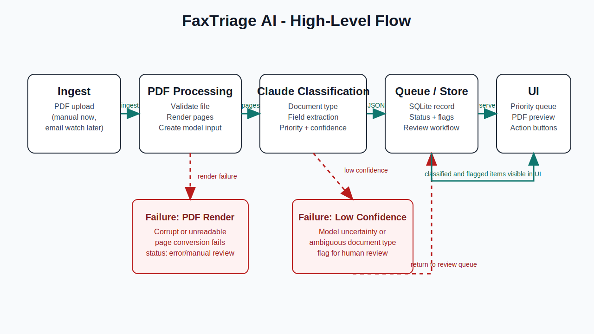

# FaxTriage AI

**Codename: Fax Capacitor**

Intelligent fax classification and routing for small healthcare practices.

## One-minute overview

### Problem
Small healthcare practices still triage incoming faxes manually, which creates delays and risk for urgent documents.

### Users
- Front desk and operations staff who process daily fax volume
- Practice managers responsible for throughput and reliability

### Workflow
Ingest PDF fax -> process pages -> classify and extract with Claude -> queue/store structured results -> present prioritized UI for review.

### Value
- Reduces manual triage time
- Surfaces urgent/high-priority items earlier
- Adds structure and consistency without replacing existing fax intake

### Status
Prototype/MVP in active development using synthetic data only; production hardening items are tracked in `/docs/PRODUCTION_HARDENING_CHECKLIST.md`.



### Demo (8-10 minutes)
**Live:** [faxcapacitor.xyz](https://faxcapacitor.xyz)

See `/docs/DEMO_SCRIPT.md` for local setup commands, expected outputs, and a short spoken narrative.

---

## What It Does

Small healthcare practices receive 30–80+ faxes daily — lab results, referral responses, prior auth decisions, pharmacy requests, and junk mail — all landing as PDFs in an email inbox. A staff member manually opens, reads, classifies, and routes each one. This takes 1–2+ hours daily and risks burying urgent documents in the pile.

FaxTriage AI adds an intelligent sorting layer on top of existing cloud fax workflows:

1. **Ingest** — Upload fax PDFs (manual drop or watched inbox)
2. **Classify** — Claude Vision API reads each document, classifies by type, extracts key metadata, assigns priority
3. **Present** — Dashboard shows a prioritized, color-coded queue instead of an undifferentiated pile

The practice changes nothing about how they receive faxes. They gain an AI-powered triage assistant.

## Architecture

```
┌─────────────────┐     ┌────────────────────┐     ┌──────────────────┐
│   PDF Ingestion  │────▶│  Claude Vision API  │────▶│    Dashboard     │
│                  │     │                    │     │                  │
│  • Manual upload │     │  • Classification  │     │  • Priority queue│
│  • Email watch   │     │  • Field extraction│     │  • PDF preview   │
│    (Phase 2)     │     │  • Confidence score│     │  • Action buttons│
└─────────────────┘     └────────────────────┘     └──────────────────┘
        │                        │                         │
        ▼                        ▼                         ▼
   Normalized PDF          Structured JSON            React + Tailwind
   images for API       (type, fields, priority)     (desktop-first UI)
```

## Document Classification Taxonomy

| Type | Priority | Description |
|------|----------|-------------|
| Lab Result | 🔴 High | Blood work, pathology, imaging — critical values flagged |
| Prior Auth Decision | 🔴 High | Approvals, denials, pending notices from payers |
| Referral Response | 🟡 Medium-High | Specialist notes, referral acknowledgments |
| Pharmacy Request | 🟡 Medium | Refill requests, formulary changes |
| Insurance Correspondence | 🟢 Low-Medium | EOBs, coverage changes, claims |
| Records Request | 🟢 Medium | Records requests from providers or legal |
| Marketing / Junk | ⚫ None | Auto-dismissed vendor solicitations |
| Other | 🔵 Review | Unclassified — flagged for manual review |

## Tech Stack

| Layer | Technology | Rationale |
|-------|-----------|-----------|
| Frontend | React + Tailwind CSS | Fast prototyping, responsive, familiar |
| Backend | Python FastAPI | Lightweight API layer with PDF processing |
| AI Engine | Claude API (Sonnet) — Vision | Best-in-class document understanding |
| Storage | SQLite (MVP) → PostgreSQL | Zero-config prototype; easy migration |
| PDF Processing | PyMuPDF / pdf2image | Page extraction, image conversion for Vision API |

## Deployment

| Component | Detail |
|-----------|--------|
| Hosting | [Railway](https://railway.app) — single container serving frontend + API |
| Domain | [faxcapacitor.xyz](https://faxcapacitor.xyz) |
| Container | Multi-stage Dockerfile (Node build → Python runtime) |
| CI/CD | Auto-deploy from `main` branch via Railway GitHub integration |

## Project Structure

```
fax-capacitor/
├── README.md
├── Dockerfile
├── railway.toml
├── requirements.txt
├── docs/
│   ├── PROJECT_PLAN.md                # Full project plan & build sequence
│   ├── ARCHITECTURE.md                # Technical architecture details
│   ├── ARCHITECTURE_DIAGRAM.svg       # Visual pipeline diagram
│   ├── CLASSIFICATION_TAXONOMY.md     # Document types & extraction fields
│   ├── DEMO_SCRIPT.md                 # Demo walkthrough with commands & narrative
│   ├── HIPAA_CONSIDERATIONS.md        # Compliance notes
│   ├── PRODUCTION_HARDENING_CHECKLIST.md  # Production readiness items
│   ├── Known_Limitations.md           # Failure modes & mitigations
│   └── AI_BUILD_WORKFLOW.md           # AI-assisted development process
├── prompts/
│   └── CLASSIFICATION_PROMPT.md       # System prompt for Claude Vision API
├── data/
│   └── synthetic-faxes/               # Test corpus (synthetic data only)
├── src/
│   ├── backend/                       # FastAPI server & classification pipeline
│   └── frontend/                      # React + Tailwind dashboard
├── scripts/
│   └── test_classification.py         # Phase 1 validation script
└── .github/
└── ISSUE_TEMPLATE/                # Build phase tracking
```

## Build Phases

| Phase | Focus | Duration | Status |
|-------|-------|----------|--------|
| 1 | Technical Validation — test Claude Vision against synthetic faxes | 2–3 hrs | ✅ Complete |
| 2 | Backend Pipeline — API server, PDF processing, Claude integration | 3–4 hrs | ✅ Complete |
| 3 | Frontend Dashboard — React queue view, document detail, upload | 3–4 hrs | ✅ Complete |
| 4 | Demo Preparation — polish, deployment, demo materials | 2–3 hrs | ✅ Complete |

## Important Notes

- **All data is synthetic.** No real patient information is used anywhere in this prototype.
- **This is a prototype/demo**, not production software. See `docs/HIPAA_CONSIDERATIONS.md` for production deployment requirements.
- **Built collaboratively with Claude** — brainstorming, architecture design, code generation, critical review, and project planning were all done in partnership with Claude, modeling how enterprise customers use the product.

---

*Whim Technology — February 2026*
